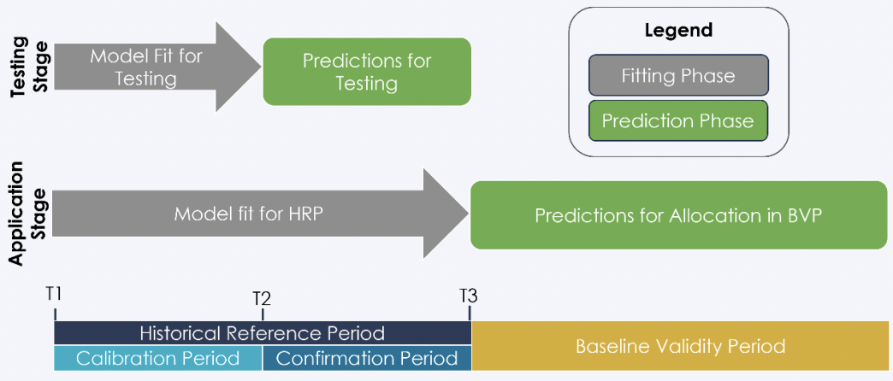
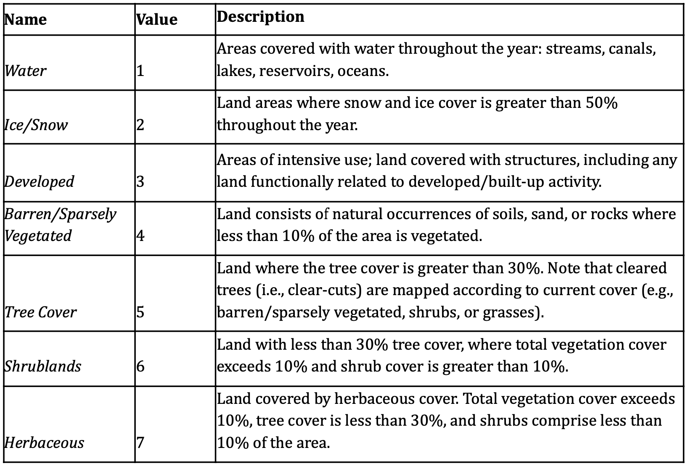

# Summary

The following details a possible workflow approach to Verra's recommended sequence of deforestation risk map development @verraVT0007UnplannedDeforestation2021.

Training data was sourced from a filtered subset of the global training sample data developed by[@stanimirovaGlobalLandCover2023]. Satellite imagery was sourced from the [Landsat Collection-2 Tier-1 Level-2](https://www.usgs.gov/landsat-missions/landsat-science-products) raster dataset. Data acquisition and pre-processing of satellite imagery was implemented in a google colab runtime [here](https://github.com/seamusrobertmurphy/VT0007-deforestation-map/blob/main/VT0007_data_preprocessing.ipynb).



## Environment setup

**Restore virtual environment**

To avoid issues with IDE settings, it is recommended to run the following virtual environment functions from an terminal external to RStudio or VScode. To update an previously loaded environment, simply run `pip3 install -r requirements.txt` in any terminal from the trunk directory.


::: {.cell}

```{.python .cell-code}
# create virtual environment 
python3 -m venv working_director_name

# activate environment's python
source working_director_name/bin/activate

# check python activation
python3
import sys 
print(sys.executable)
quit()

# restore environment of cloned repo
python3 pip install -r requirements.txt

# install packages manually
python3 -m pip install numpy jupyter earthengine-api

# save index of loaded packages
python3 -m pip freeze > requirements.txt
```
:::


**Assign `rgee` kernel, `gcs` directory & credentials**


::: {.cell}

```{.r .cell-code}
library(rgee)
library(reticulate)
library(googledrive)
library(googleCloudStorageR)

reticulate::use_python("./bin/python3")
reticulate::py_run_string("import ee; ee.Initialize()")
rgee::ee_install_set_pyenv(py_path = "./bin/python3", py_env = "./")
rgee::ee_path = path.expand("/home/seamus/.config/earthengine/seamusrobertmurphy/credentials")
# rgee::ee_install()
rgee::ee_Initialize(user = "seamusrobertmurphy", gcs = T, drive = T)


# asssign the SaK & user for interactive web renders
SaK_file = "/home/seamus/Repos/api-keys/SaK_rgee.json" 
ee_utils_sak_copy(sakfile =  SaK_file, users = "seamusrobertmurphy")

# Confirm project_id & bucket
project_id <- ee_get_earthengine_path() %>% 
  list.files(., "\\.json$", full.names = TRUE) %>% 
  jsonlite::read_json() %>% 
  '$'(project_id) 
#googleCloudStorageR::gcs_create_bucket("deforisk_bucket_1", projectId = project_id)

# Validate SaK credentials
ee_utils_sak_validate(
    sakfile = SaK_file,
    bucket = "deforisk_bucket_1",
    quiet = F 
 )
```
:::


**Jurisdictional boundaries**


::: {.cell}

```{.r .cell-code}
# assign master crs
crs_master    = sf::st_crs("epsg:4326")
# derive aoi windows
aoi_country   = geodata::gadm(country="GUY", level=0, path=tempdir()) |>
  sf::st_as_sf() |> sf::st_cast() |> sf::st_transform(crs_master)

aoi_states    = geodata::gadm(country="GUY", level=1, path=tempdir()) |>
  sf::st_as_sf() |> sf::st_cast() |> sf::st_transform(crs_master) |>
  dplyr::rename(State = NAME_1)

aoi_target    = dplyr::filter(aoi_states, State == "Barima-Waini") 
aoi_target_ee = rgee::sf_as_ee(aoi_target)

# visualize
tmap::tmap_mode("view")
tmap::tm_shape(aoi_states) + tmap::tm_borders(col = "white", lwd = 0.5) +
  tmap::tm_text("State", col = "white", size = 1, alpha = 0.3, just = "bottom") +
  tmap::tm_shape(aoi_country) + tmap::tm_borders(col = "white", lwd = 1) +
  tmap::tm_shape(aoi_target) + tmap::tm_borders(col = "red", lwd = 2) +
  tmap::tm_text("State", col = "red", size = 2) +
  tmap::tm_basemap("Esri.WorldImagery")
```

::: {.cell-output-display}
preserve7c8cbadb258d1cb4
:::
:::


## Assemble HRP data cube

We assembled and processed a data cube for the ten year historical reference period (HRP) between start date 2014-01-01 and end date 2024-12-31 for the state of Barina Waini, Guyana. Masking is applied to cloud, shadow and water surfaces with median normalization using a cloudless pixel ranking.


::: {.cell}

```{.r .cell-code}
cube_2014 = sits_cube(
  source     = "MPC",
  collection = "LANDSAT-C2-L2",
  data_dir   = here::here("cubes", "mosaic"),
  bands      = c("BLUE", "GREEN", "RED", "RED", "NIR08", "SWIR16", "SWIR22", "NDVI"),
  version    = "mosaic"
)

sits_view(cube_2014, band = "NDVI", date = "2014-01-11", opacity = 1)
```
:::

::: {.cell layout-ncol="2"}

```{.r .cell-code}
tmap::tmap_options(max.raster = c(plot = 80000000, view = 100000000))

rgb_2014_stars = stars::read_stars("./cubes/mosaic/LANDSAT_TM-ETM-OLI_231055_RGB_2014-01-11.tif")
#rgb_2024_stars = stars::read_stars("./cubes/mosaic/LANDSAT_TM-ETM-OLI_231055_RGB_2024-01-07.tif")

tmap::tm_shape(rgb_2014_stars) +
  tm_raster("LANDSAT_TM-ETM-OLI_231055_RGB_2014-01-11.tif", title = "RGB 2014") 
```

::: {.cell-output-display}
preserve95a63da1386674d0
:::
:::


## LULC classification

We import the GLanCE training dataset of annual times series points that include 7 land cover classes (Figure 2; [@woodcockGlobalLandCover]). Training samples are fitted to a Random Forest model and post-processed with a Bayesian smoothing and then evaluated using confusion matrix.

The classifier is then calibrated by mapping pixel uncertainty, adding new samples in areas of high uncertainty, reclassifying with improved samples and re-evaluated using confusion matrix.




::: {.cell}

```{.r .cell-code}
# extract dataset from ee: https://gee-community-catalog.org/projects/glance_training/?h=training 
#glance_training_url = "https://drive.google.com/file/d/1FhWTpSGFRTodDCY2gSGhssLuP2Plq4ZE/view?usp=drive_link"
# file_name = "glance_training.csv"
# download.file(url = url, path = here::here("training"), destfile = file_name)
glance_training = read.csv(here::here("training", "glance_training.csv"))
glimpse(glance_training)

glance_training_edit = dplyr::select(
    glance_training, Lon, Lat, Glance_Class_ID_level1, Start_Year, End_Year) |>
    dplyr::rename(longitude = Lon) |>
    dplyr::rename(latitude = Lat) |>
    dplyr::rename(label = Glance_Class_ID_level1) |>
    mutate(start_date = ymd(paste(Start_Year, "01", "01", sep = "-"))) |>
    mutate(end_date = ymd(paste(End_Year, "01", "01", sep = "-"))) |>
    dplyr::select(-Start_Year, -End_Year) 
glimpse(glance_training_edit)

# convert to sf for spatial filtering
glance_training_sf = sf::st_as_sf(
    glance_training_edit, coords = c("longitude", "latitude"))

tmap::tm_shape(glance_training_sf) +
  tm_dots(col = "red", size = 0.1, alpha = 0.7)  # Points in red

# Plot the map
tmap_mode("view")  # Interactive map
tm_map 

tmap::tmap_mode("view")
tmap::tm_shape(glance_training_sf) + tmap::tm_borders(col = "white", lwd = 0.5) +
  tmap::tm_text("State", col = "white", size = 1, alpha = 0.3, just = "bottom") +
  tmap::tm_shape(aoi_country) + tmap::tm_borders(col = "white", lwd = 1) +
  tmap::tm_shape(aoi_target) + tmap::tm_borders(col = "red", lwd = 2) +
  tmap::tm_text("State", col = "red", size = 2) +
  tmap::tm_basemap("Esri.WorldImagery")


glance_training_sf = sf::st_intersection(glance_training_sf, aoi_target)

plot(st_geometry(glance_training_sf))

#dplyr::filter(start_date=="2014-01-01" | end_date=="2014-01-01" | start_date=="2024-01-01" | end_date=="2024-01-01")


glimpse(glance_training_edit)

labels <- c(
  "1" = "Water",
  "2" = "Ice",
  "3" = "Urban",
  "4" = "Barren",
  "5" = "Trees",
  "6" = "Shrublands",
  "7" = "Herbaceous"
)

data("samples_prodes_4classes")
# Select the same three bands used in the data cube
samples_4classes_3bands <- sits_select(
  data = samples_prodes_4classes,
  bands = c("B02", "B8A", "B11")
  )

# Train a random forest model
rfor_model <- sits_train(
  samples = samples_4classes_3bands,
  ml_method = sits_rfor()
  )

# Classify the small area cube
s2_cube_probs <- sits_classify(
  data = s2_reg_cube_ro,
  ml_model = rfor_model,
  output_dir = "./cubes/02_class/",
  memsize = 15,
  multicores = 5
  )

# Post-process the probability cube
s2_cube_bayes <- sits_smooth(
  cube = s2_cube_probs,
  output_dir = "./cubes/02_class/",
  memsize = 16,
  multicores = 4
  )

# Label the post-processed  probability cube
s2_cube_label <- sits_label_classification(
  cube = s2_cube_bayes,
  output_dir = "./cubes/02_class/",
  memsize = 16,
  multicores = 4
  )

plot(s2_cube_label)
```
:::


## Map uncertainty

To improve model performance, we estimate class uncertainty and plot these pixel error metrics. Results below reveal highest uncertainty levels in classification of wetland and water areas.


::: {.cell}

```{.r .cell-code}
# Calculate the uncertainty cube
s2_cube_uncert <- sits_uncertainty(
  cube = s2_cube_bayes,
  type = "margin",
  output_dir = "./cubes/03_error/",
  memsize = 16,
  multicores = 4
)

plot(s2_cube_uncert)
```
:::


As expected, the places of highest uncertainty are those covered by surface water or associated with wetlands. These places are likely to be misclassified. For this reason, sits provides `sits_uncertainty_sampling()`, which takes the uncertainty cube as its input and produces a tibble with locations in WGS84 with high uncertainty [@camaraUncertaintyActiveLearning].


::: {.cell}

```{.r .cell-code}
# Find samples with high uncertainty
new_samples <- sits_uncertainty_sampling(
  uncert_cube = s2_cube_uncert,
  n = 20,
  min_uncert = 0.5,
  sampling_window = 10
  )

# View the location of the samples
sits_view(new_samples)
```
:::


## Add training samples

We can then use these points of high-uncertainty as new samples to add to our current training dataset. Once we identify their feature classes and relabel them correctly, we append them to derive an augmented `samples_round_2`.


::: {.cell}

```{.r .cell-code}
# Label the new samples
new_samples$label <- "Wetland"

# Obtain the time series from the regularized cube
new_samples_ts <- sits_get_data(
  cube = s2_reg_cube_ro,
  samples = new_samples
  )

# Add new class to original samples
samples_round_2 <- dplyr::bind_rows(
  samples_4classes_3bands,
  new_samples_ts
  )

# Train a RF model with the new sample set
rfor_model_v2 <- sits_train(
  samples = samples_round_2,
  ml_method = sits_rfor()
  )

# Classify the small area cube
s2_cube_probs_v2 <- sits_classify(
  data = s2_reg_cube_ro,
  ml_model = rfor_model_v2,
  output_dir = "./cubes/02_class/",
  version = "v2",
  memsize = 16,
  multicores = 4
  )

# Post-process the probability cube
s2_cube_bayes_v2 <- sits_smooth(
  cube = s2_cube_probs_v2,
  output_dir = "./cubes/04_smooth/",
  version = "v2",
  memsize = 16,
  multicores = 4
  )

# Label the post-processed  probability cube
s2_cube_label_v2 <- sits_label_classification(
  cube = s2_cube_bayes_v2,
  output_dir = "./cubes/05_tuned/",
  version = "v2",
  memsize = 16,
  multicores = 4
  )

# Plot the second version of the classified cube
plot(s2_cube_label_v2)
```
:::


## Remap uncertainty


::: {.cell}

```{.r .cell-code}
# Calculate the uncertainty cube
s2_cube_uncert_v2 <- sits_uncertainty(
  cube = s2_cube_bayes_v2,
  type = "margin",
  output_dir = "./cubes/03_error/",
  version = "v2",
  memsize = 16,
  multicores = 4
)

plot(s2_cube_uncert_v2)
```
:::


## Accuracy assessment

To select a validation subset of the map, `sits` recommends Cochran’s method for stratified random sampling [@cochran1977sampling]. The method divides the population into homogeneous subgroups, or strata, and then applying random sampling within each stratum. Alternatively, ad-hoc parameterization is suggested as follows.


::: {.cell}

```{.r .cell-code}
ro_sampling_design <- sits_sampling_design(
  cube = s2_cube_label_v2,
  expected_ua = c(
    "Burned_Area"       = 0.75,
    "Cleared_Area"      = 0.70,
    "Forest"            = 0.75,
    "Highly_Degraded"   = 0.70,
    "Wetland"           = 0.70
  ),
  alloc_options         = c(120, 100),
  std_err               = 0.01,
  rare_class_prop       = 0.1
)
# show sampling desing
ro_sampling_design
```
:::


## Split train/test data


::: {.cell}

```{.r .cell-code}
ro_samples_sf <- sits_stratified_sampling(
  cube                  = s2_cube_label_v2,
  sampling_design       = ro_sampling_design,
  alloc                 = "alloc_120",
  multicores            = 4,
  shp_file              = "./samples/ro_samples.shp"
)

sf::st_write(ro_samples_sf,
  "./samples/ro_samples.csv",
  layer_options = "GEOMETRY=AS_XY",
  append = FALSE # TRUE if editing existing sample
)
```
:::


## Confusion matrix


::: {.cell}

```{.r .cell-code}
# Calculate accuracy according to Olofsson's method
area_acc <- sits_accuracy(s2_cube_label_v2,
  validation = ro_samples_sf,
  multicores = 4
)
# Print the area estimated accuracy
area_acc

# Print the confusion matrix
area_acc$error_matrix
```
:::


## Times series visualization


::: {.cell}

```{.r .cell-code}
summary(as.data.frame(ro_samples_sf))
```
:::


## Deforestation binary map

## Deforestation risk map

# 2. Workflow in Python -\> `GEE`


::: {.cell}

```{.r .cell-code}
# Set your Python ENV
Sys.setenv("RETICULATE_PYTHON" = "/usr/bin/python3")
# Set Google Cloud SDK 
Sys.setenv("EARTHENGINE_GCLOUD" = "~/seamus/google-cloud-sdk/bin/")

library(rgee) 
ee_Authenticate()
ee_install_upgrade()
ee_Initialize()
```
:::


#### Housekeeping


::: {.cell}

```{.r .cell-code}
# convert markdown to script.R 
knitr::purl("VT0007-deforestation-risk-map.qmd")

# display environment setup
devtools::session_info()
```
:::