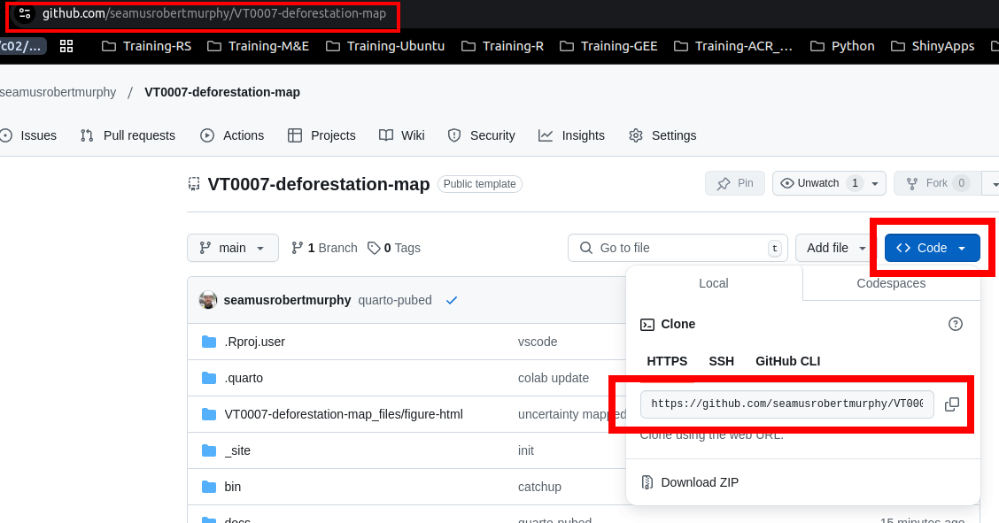

::: {.cell}
<style type="text/css">
div.column {
    display: inline-block;
    vertical-align: top;
    width: 50%;
}

#TOC::before {
  content: "";
  display: block;
  height: 50px;
  width: 200px;
  background-image: url(https://verra.org/wp-content/uploads/2024/11/VCS-overview-300x254-1.webp);
  background-size: contain;
  background-position: center;
  background-position: 50% 50%;
  padding-top: 5px !important;
  background-repeat: no-repeat;
}
</style>
:::


# Summary

The following details a possible workflow approach to Verra's recommended sequence of deforestation risk map development @verraVT0007UnplannedDeforestation2021.

Training data was sourced from a filtered subset of the global training sample data developed by[@stanimirovaGlobalLandCover2023]. Satellite imagery was sourced from the [Landsat Collection-2 Tier-1 Level-2](https://www.usgs.gov/landsat-missions/landsat-science-products) raster dataset. Data acquisition and pre-processing of satellite imagery was implemented in a google colab runtime [here](https://github.com/seamusrobertmurphy/VT0007-deforestation-map/blob/main/VT0007_data_preprocessing.ipynb).

{fig-align="center" width="750"}

# 1. Workflow in R -\> `sits`

## Environment setup

All required R packages are listed alphabetically and installed together via the hidden `setup` chunk at the top of this R-markdown file. All packages and kernel versions are also listed using the `session_info()` command at the bottom of the markdown.

**Clone github repository**

To copy and run these scripts locally, you may clone the project's github repository to your machine using git commands from any terminal ([git installation here](https://git-scm.com/downloads)) or by opening a 'new project' with 'version control' settings from the File menu options in your IDE. To assign correct 'version control', enter the repository's github URL, which can be located [here](https://github.com/seamusrobertmurphy/VT0007-deforestation-map) (Figure 2). Cloning will download all input, output, and script files and subfolders to your chosen directory, which you can then open, run and edit locally without github syncing or with to contribute suggested commits to certain branches as you please.

{fig-align="center" width="750"}

**Restore virtual environment**

To avoid issues with IDE settings and dotfiles, run the following code chunk of virtual environment setup from a terminal that is external to RStudio or VScode. Open the terminal in the top folder of the cloned directory and run the following. To update a previously loaded environment, simply run `pip3 install -r requirements.txt` and skip the following.


::: {.cell}

```{.python .cell-code}
# create virtual environment 
python3 -m venv working_director_name

# activate environment's python
source working_director_name/bin/activate

# check python activation
python3
import sys 
print(sys.executable)
quit()

# restore environment of cloned repo
python3 pip install -r requirements.txt

# install packages manually
python3 -m pip install numpy jupyter earthengine-api

# save added packages for later use
python3 -m pip freeze > requirements.txt
```
:::


**Assign `rgee` kernel, `gcs` directory & credentials**

If running this script and configuring your environment for the first time, run the code chunk directly below. If updating a previously loaded environment, only run the second code chunk below.


::: {.cell}

```{.r .cell-code}
# assign reticulate to the python located in the project's virtual environment 
reticulate::use_python("./bin/python3")
reticulate::py_run_string("import ee; ee.Initialize()")
# assign rgee to the same python in the virtual environment & restart (Windows restart required)
rgee::ee_install_set_pyenv(py_path = "./bin/python3", py_env = "./", confirm = F)
# save earth engine username and password to plain text file & assign location:
rgee::ee_path = path.expand("~/.config/earthengine/seamusrobertmurphy/credentials", confirm = F)

# install earth engine api via the rgee package
rgee::ee_install()
# activate and authenticate yours and the project's google earth engine access
rgee::ee_Authenticate()
rgee::ee_Initialize(user = "username_here", gcs = T, drive = T)
# look for any prompts in active terminal window below o

# --- advanced system configuration optional --- 
# save a Service Account Key to enable 'sign-in' & web renders w/ these links:
# SaK setup: https://cloud.google.com/iam/docs/service-accounts
# SaK guide: https://r-spatial.github.io/rgee/articles/rgee05.html

# point to your saved SaK credientials & assign users
SaK_file = "/home/seamus/Repos/api-keys/SaK_rgee.json" 
ee_utils_sak_copy(sakfile =  SaK_file, users = "seamusrobertmurphy")

# confirm project_id & bucket
project_id <- ee_get_earthengine_path() %>% 
  list.files(., "\\.json$", full.names = TRUE) %>% 
  jsonlite::read_json() %>% 
  '$'(project_id) 

# create a google cloud bucket for storing project outputs
googleCloudStorageR::gcs_create_bucket("deforisk_bucket_1", projectId = project_id)

# validate SaK credentials
ee_utils_sak_validate(
    sakfile = SaK_file,
    bucket = "deforisk_bucket_1",
    quiet = F 
 )
```
:::


::: {.cell}

```{.r .cell-code}
# assign reticulate to the python located in the project's virtual environment 
reticulate::use_python("./bin/python3")
reticulate::py_run_string("import ee; ee.Initialize()")
# assign rgee to the same python in the virtual environment & restart (Windows restart required)
rgee::ee_install_set_pyenv(py_path = "./bin/python3", py_env = "./", confirm = F)
rgee::ee_path = path.expand("/home/seamus/.config/earthengine/seamusrobertmurphy/credentials", confirm = F)
# activate and authenticate yours and the project's google earth engine access
rgee::ee_Initialize(user = "seamusrobertmurphy", gcs = T, drive = T)
```
:::


**Jurisdictional boundaries**


::: {.cell}

```{.r .cell-code}
# assign master crs
crs_master    = sf::st_crs("epsg:4326")
# derive aoi windows
aoi_country   = geodata::gadm(country="GUY", level=0, path=tempdir()) |>
  sf::st_as_sf() |> sf::st_cast() |> sf::st_transform(crs_master)

aoi_states    = geodata::gadm(country="GUY", level=1, path=tempdir()) |>
  sf::st_as_sf() |> sf::st_cast() |> sf::st_transform(crs_master) |>
  dplyr::rename(State = NAME_1)

aoi_target    = dplyr::filter(aoi_states, State == "Barima-Waini") 
aoi_target_ee = rgee::sf_as_ee(aoi_target)
```

::: {.cell-output .cell-output-stdout}

```
Error : could not find a Python environment for /
```


:::

::: {.cell-output .cell-output-error}

```
Error: Installation of Python not found, Python bindings not loaded.
See the Python "Order of Discovery" here: https://rstudio.github.io/reticulate/articles/versions.html#order-of-discovery.
```


:::

```{.r .cell-code}
# visualize
tmap::tmap_mode("view")
tmap::tm_shape(aoi_states) + tmap::tm_borders(col = "white", lwd = 0.5) +
  tmap::tm_text("State", col = "white", size = 1, alpha = 0.3, just = "bottom") +
  tmap::tm_shape(aoi_country) + tmap::tm_borders(col = "white", lwd = 1) +
  tmap::tm_shape(aoi_target) + tmap::tm_borders(col = "red", lwd = 2) +
  tmap::tm_text("State", col = "red", size = 2) +
  tmap::tm_basemap("Esri.WorldImagery")
```

::: {.cell-output-display}
preserveee5c6fe5130d1354
:::
:::


## Satellite data acquisition

We assembled and processed a data cube for the ten year historical reference period (HRP) between start date 2014-01-01 and end date 2024-12-31 for the state of Barina Waini, Guyana. Masking is applied to cloud, shadow and water surfaces with median normalization using a cloudless pixel ranking.


::: {.cell}

```{.r .cell-code}
cube_2014 = sits_cube(
  source     = "MPC",
  collection = "LANDSAT-C2-L2",
  data_dir   = here::here("cubes", "mosaic"),
  bands      = c("BLUE", "GREEN", "RED", "RED", "NIR08", "SWIR16", "SWIR22", "NDVI"),
  version    = "mosaic"
)

sits_view(cube_2014, band = "NDVI", date = "2014-01-11", opacity = 1)
```
:::


::: {.cell layout-ncol="2"}

```{.r .cell-code}
tmap::tmap_options(max.raster = c(plot = 80000000, view = 100000000))

#rgb_2014 = raster::raster("./cubes/mosaic/LANDSAT_TM-ETM-OLI_231055_RGB_2014-01-11.tif")
rgb_2014 = terra::rast("./cubes/mosaic/LANDSAT_TM-ETM-OLI_231055_RGB_2014-01-11.tif")
```

::: {.cell-output .cell-output-error}

```
Error: [rast] file does not exist: ./cubes/mosaic/LANDSAT_TM-ETM-OLI_231055_RGB_2014-01-11.tif
```


:::

```{.r .cell-code}
rgb_2014 = raster::stretch(rgb_2014, minv = 0, maxv = 255, minq = 0.1, maxq = 0.99)
```

::: {.cell-output .cell-output-error}

```
Error in h(simpleError(msg, call)): error in evaluating the argument 'x' in selecting a method for function 'stretch': object 'rgb_2014' not found
```


:::

```{.r .cell-code}
tmap::tm_shape(rgb_2014) +
  tmap::tm_rgb() 
```

::: {.cell-output .cell-output-error}

```
Error in FUN(X[[i]], ...): object 'rgb_2014' not found
```


:::

```{.r .cell-code}
B1 = raster::raster("LC08_L2SP_166072_20210819_20210827_02_T1_SR_B1.TIF")
```

::: {.cell-output .cell-output-error}

```
Error in .rasterObjectFromFile(x, band = band, objecttype = "RasterLayer", : Cannot create a RasterLayer object from this file. (file does not exist)
```


:::

```{.r .cell-code}
B2 = raster::raster("LC08_L2SP_166072_20210819_20210827_02_T1_SR_B2.TIF")
```

::: {.cell-output .cell-output-error}

```
Error in .rasterObjectFromFile(x, band = band, objecttype = "RasterLayer", : Cannot create a RasterLayer object from this file. (file does not exist)
```


:::

```{.r .cell-code}
B3 = raster::raster("LC08_L2SP_166072_20210819_20210827_02_T1_SR_B3.TIF")
```

::: {.cell-output .cell-output-error}

```
Error in .rasterObjectFromFile(x, band = band, objecttype = "RasterLayer", : Cannot create a RasterLayer object from this file. (file does not exist)
```


:::

```{.r .cell-code}
B4 = raster::raster("LC08_L2SP_166072_20210819_20210827_02_T1_SR_B4.TIF")
```

::: {.cell-output .cell-output-error}

```
Error in .rasterObjectFromFile(x, band = band, objecttype = "RasterLayer", : Cannot create a RasterLayer object from this file. (file does not exist)
```


:::

```{.r .cell-code}
B5 = raster::raster("LC08_L2SP_166072_20210819_20210827_02_T1_SR_B5.TIF")
```

::: {.cell-output .cell-output-error}

```
Error in .rasterObjectFromFile(x, band = band, objecttype = "RasterLayer", : Cannot create a RasterLayer object from this file. (file does not exist)
```


:::

```{.r .cell-code}
B6 = raster::raster("LC08_L2SP_166072_20210819_20210827_02_T1_SR_B6.TIF")
```

::: {.cell-output .cell-output-error}

```
Error in .rasterObjectFromFile(x, band = band, objecttype = "RasterLayer", : Cannot create a RasterLayer object from this file. (file does not exist)
```


:::

```{.r .cell-code}
B7 = raster::raster("LC08_L2SP_166072_20210819_20210827_02_T1_SR_B7.TIF")
```

::: {.cell-output .cell-output-error}

```
Error in .rasterObjectFromFile(x, band = band, objecttype = "RasterLayer", : Cannot create a RasterLayer object from this file. (file does not exist)
```


:::

```{.r .cell-code}
stack_2014 <- stack(B5, B4, B3)
```

::: {.cell-output .cell-output-error}

```
Error in h(simpleError(msg, call)): error in evaluating the argument 'x' in selecting a method for function 'stack': object 'B5' not found
```


:::
:::


## LULC classification

We extracted a training sample from the GLanCE dataset of annual times series points that intersect with our spatial of temporal window of interest[@woodcockGlobalLandCover]). These training samples include locations of 7 land cover classes (Figure 2) which were

Training samples are fitted to a Random Forest model and post-processed with a Bayesian smoothing and then evaluated using confusion matrix.

The classifier is then calibrated by mapping pixel uncertainty, adding new samples in areas of high uncertainty, reclassifying with improved samples and re-evaluated using confusion matrix.


::: {.cell}

```{.r .cell-code}
# extract dataset from ee: https://gee-community-catalog.org/projects/glance_training/?h=training 
#glance_training_url = "https://drive.google.com/file/d/1FhWTpSGFRTodDCY2gSGhssLuP2Plq4ZE/view?usp=drive_link"
# file_name = "glance_training.csv"
# download.file(url = url, path = here::here("training"), destfile = file_name)
glance_training = read.csv(here::here("training", "glance_training.csv"))
glimpse(glance_training)

glance_training_edit = dplyr::select(
    glance_training, Lon, Lat, Glance_Class_ID_level1, Start_Year, End_Year) |>
    dplyr::rename(longitude = Lon) |>
    dplyr::rename(latitude = Lat) |>
    dplyr::rename(label = Glance_Class_ID_level1) |>
    dplyr::select() |>
    mutate(start_date = ymd(paste(Start_Year, "01", "01", sep = "-"))) |>
    mutate(end_date = ymd(paste(End_Year, "01", "01", sep = "-"))) |>
    dplyr::select(-Start_Year, -End_Year) 

glimpse(glance_training_edit)

# convert to sf for spatial filtering
glance_training_sf = sf::st_as_sf(
    glance_training_edit, coords = c("longitude", "latitude"))

tmap::tm_shape(glance_training_sf) +
  tm_dots(col = "red", size = 0.1, alpha = 0.7)  # Points in red

# Plot the map
tmap_mode("view")  # Interactive map
tm_map 

tmap::tmap_mode("view")
tmap::tm_shape(glance_training_sf) + tmap::tm_borders(col = "white", lwd = 0.5) +
  tmap::tm_text("State", col = "white", size = 1, alpha = 0.3, just = "bottom") +
  tmap::tm_shape(aoi_country) + tmap::tm_borders(col = "white", lwd = 1) +
  tmap::tm_shape(aoi_target) + tmap::tm_borders(col = "red", lwd = 2) +
  tmap::tm_text("State", col = "red", size = 2) +
  tmap::tm_basemap("Esri.WorldImagery")


glance_training_sf = sf::st_intersection(glance_training_sf, aoi_target)

plot(st_geometry(glance_training_sf))

#dplyr::filter(start_date=="2014-01-01" | end_date=="2014-01-01" | start_date=="2024-01-01" | end_date=="2024-01-01")


glimpse(glance_training_edit)

labels <- c(
  "1" = "Water",
  "2" = "Ice",
  "3" = "Urban",
  "4" = "Barren",
  "5" = "Trees",
  "6" = "Shrublands",
  "7" = "Herbaceous"
)

data("samples_prodes_4classes")
# Select the same three bands used in the data cube
samples_4classes_3bands <- sits_select(
  data = samples_prodes_4classes,
  bands = c("B02", "B8A", "B11")
  )

# Train a random forest model
rfor_model <- sits_train(
  samples = samples_4classes_3bands,
  ml_method = sits_rfor()
  )

# Classify the small area cube
s2_cube_probs <- sits_classify(
  data = s2_reg_cube_ro,
  ml_model = rfor_model,
  output_dir = "./cubes/02_class/",
  memsize = 15,
  multicores = 5
  )

# Post-process the probability cube
s2_cube_bayes <- sits_smooth(
  cube = s2_cube_probs,
  output_dir = "./cubes/02_class/",
  memsize = 16,
  multicores = 4
  )

# Label the post-processed  probability cube
s2_cube_label <- sits_label_classification(
  cube = s2_cube_bayes,
  output_dir = "./cubes/02_class/",
  memsize = 16,
  multicores = 4
  )

plot(s2_cube_label)
```
:::


## Map uncertainty

To improve model performance, we estimate class uncertainty and plot these pixel error metrics. Results below reveal highest uncertainty levels in classification of wetland and water areas.


::: {.cell}

```{.r .cell-code}
# Calculate the uncertainty cube
s2_cube_uncert <- sits_uncertainty(
  cube = s2_cube_bayes,
  type = "margin",
  output_dir = "./cubes/03_error/",
  memsize = 16,
  multicores = 4
)

plot(s2_cube_uncert)
```
:::


As expected, the places of highest uncertainty are those covered by surface water or associated with wetlands. These places are likely to be misclassified. For this reason, sits provides `sits_uncertainty_sampling()`, which takes the uncertainty cube as its input and produces a tibble with locations in WGS84 with high uncertainty [@camaraUncertaintyActiveLearning].


::: {.cell}

```{.r .cell-code}
# Find samples with high uncertainty
new_samples <- sits_uncertainty_sampling(
  uncert_cube = s2_cube_uncert,
  n = 20,
  min_uncert = 0.5,
  sampling_window = 10
  )

# View the location of the samples
sits_view(new_samples)
```
:::


## Add training samples

We can then use these points of high-uncertainty as new samples to add to our current training dataset. Once we identify their feature classes and relabel them correctly, we append them to derive an augmented `samples_round_2`.


::: {.cell}

```{.r .cell-code}
# Label the new samples
new_samples$label <- "Wetland"

# Obtain the time series from the regularized cube
new_samples_ts <- sits_get_data(
  cube = s2_reg_cube_ro,
  samples = new_samples
  )

# Add new class to original samples
samples_round_2 <- dplyr::bind_rows(
  samples_4classes_3bands,
  new_samples_ts
  )

# Train a RF model with the new sample set
rfor_model_v2 <- sits_train(
  samples = samples_round_2,
  ml_method = sits_rfor()
  )

# Classify the small area cube
s2_cube_probs_v2 <- sits_classify(
  data = s2_reg_cube_ro,
  ml_model = rfor_model_v2,
  output_dir = "./cubes/02_class/",
  version = "v2",
  memsize = 16,
  multicores = 4
  )

# Post-process the probability cube
s2_cube_bayes_v2 <- sits_smooth(
  cube = s2_cube_probs_v2,
  output_dir = "./cubes/04_smooth/",
  version = "v2",
  memsize = 16,
  multicores = 4
  )

# Label the post-processed  probability cube
s2_cube_label_v2 <- sits_label_classification(
  cube = s2_cube_bayes_v2,
  output_dir = "./cubes/05_tuned/",
  version = "v2",
  memsize = 16,
  multicores = 4
  )

# Plot the second version of the classified cube
plot(s2_cube_label_v2)
```
:::


## Remap uncertainty


::: {.cell}

```{.r .cell-code}
# Calculate the uncertainty cube
s2_cube_uncert_v2 <- sits_uncertainty(
  cube = s2_cube_bayes_v2,
  type = "margin",
  output_dir = "./cubes/03_error/",
  version = "v2",
  memsize = 16,
  multicores = 4
)

plot(s2_cube_uncert_v2)
```
:::


## Accuracy assessment

To select a validation subset of the map, `sits` recommends Cochran's method for stratified random sampling [@cochran1977sampling]. The method divides the population into homogeneous subgroups, or strata, and then applying random sampling within each stratum. Alternatively, ad-hoc parameterization is suggested as follows.


::: {.cell}

```{.r .cell-code}
ro_sampling_design <- sits_sampling_design(
  cube = s2_cube_label_v2,
  expected_ua = c(
    "Burned_Area"       = 0.75,
    "Cleared_Area"      = 0.70,
    "Forest"            = 0.75,
    "Highly_Degraded"   = 0.70,
    "Wetland"           = 0.70
  ),
  alloc_options         = c(120, 100),
  std_err               = 0.01,
  rare_class_prop       = 0.1
)
# show sampling desing
ro_sampling_design
```
:::


## Split train/test data


::: {.cell}

```{.r .cell-code}
ro_samples_sf <- sits_stratified_sampling(
  cube                  = s2_cube_label_v2,
  sampling_design       = ro_sampling_design,
  alloc                 = "alloc_120",
  multicores            = 4,
  shp_file              = "./samples/ro_samples.shp"
)

sf::st_write(ro_samples_sf,
  "./samples/ro_samples.csv",
  layer_options = "GEOMETRY=AS_XY",
  append = FALSE # TRUE if editing existing sample
)
```
:::


## Confusion matrix


::: {.cell}

```{.r .cell-code}
# Calculate accuracy according to Olofsson's method
area_acc <- sits_accuracy(s2_cube_label_v2,
  validation = ro_samples_sf,
  multicores = 4
)
# Print the area estimated accuracy
area_acc

# Print the confusion matrix
area_acc$error_matrix
```
:::


## Times series visualization


::: {.cell}

```{.r .cell-code}
summary(as.data.frame(ro_samples_sf))
```
:::


## Deforestation binary map

## Deforestation risk map

# 2. Workflow in Python -\> `GEE`


::: {.cell}

```{.r .cell-code}
# Set your Python ENV
Sys.setenv("RETICULATE_PYTHON" = "/usr/bin/python3")
# Set Google Cloud SDK 
Sys.setenv("EARTHENGINE_GCLOUD" = "~/seamus/google-cloud-sdk/bin/")

library(rgee) 
ee_Authenticate()
ee_install_upgrade()
ee_Initialize()
```
:::


#### Housekeeping


::: {.cell}

```{.r .cell-code}
# convert markdown to script.R 
knitr::purl("VT0007-deforestation-risk-map.qmd")

# display environment setup
devtools::session_info()
```
:::


### Environment snapshot


::: {.cell}

```{.r .cell-code}
devtools::session_info()
```

::: {.cell-output .cell-output-stdout}

```
─ Session info ───────────────────────────────────────────────────────────────
 setting  value
 version  R version 4.3.0 (2023-04-21)
 os       macOS 15.6.1
 system   aarch64, darwin20
 ui       X11
 language (EN)
 collate  en_CA.UTF-8
 ctype    en_CA.UTF-8
 tz       America/Vancouver
 date     2025-08-26
 pandoc   3.7.0.2 @ /opt/local/bin/ (via rmarkdown)
 quarto   1.7.33 @ /usr/local/bin/quarto

─ Packages ───────────────────────────────────────────────────────────────────
 package             * version    date (UTC) lib source
 abind               * 1.4-8      2024-09-12 [1] CRAN (R 4.3.3)
 animation           * 2.7        2021-10-07 [1] CRAN (R 4.3.3)
 ape                   5.8-1      2024-12-16 [1] CRAN (R 4.3.3)
 askpass               1.2.1      2024-10-04 [1] CRAN (R 4.3.3)
 assertthat            0.2.1      2019-03-21 [1] CRAN (R 4.3.3)
 backports             1.5.0      2024-05-23 [1] CRAN (R 4.3.3)
 base64enc             0.1-3      2015-07-28 [1] CRAN (R 4.3.3)
 BIOMASS             * 2.2.4      2025-05-19 [1] CRAN (R 4.3.3)
 bit                   4.6.0      2025-03-06 [1] CRAN (R 4.3.3)
 bit64                 4.6.0-1    2025-01-16 [1] CRAN (R 4.3.3)
 bitops                1.0-9      2024-10-03 [1] CRAN (R 4.3.3)
 boot                  1.3-31     2024-08-28 [1] CRAN (R 4.3.3)
 brew                  1.0-10     2023-12-16 [1] CRAN (R 4.3.3)
 brio                  1.1.5      2024-04-24 [1] CRAN (R 4.3.3)
 bslib                 0.9.0      2025-01-30 [1] CRAN (R 4.3.3)
 cachem                1.1.0      2024-05-16 [1] CRAN (R 4.3.3)
 callr                 3.7.6      2024-03-25 [1] CRAN (R 4.3.3)
 caret               * 7.0-1      2024-12-10 [1] CRAN (R 4.3.3)
 class                 7.3-23     2025-01-01 [1] CRAN (R 4.3.3)
 classInt              0.4-11     2025-01-08 [1] CRAN (R 4.3.3)
 cli                 * 3.6.5      2025-04-23 [1] CRAN (R 4.3.3)
 clue                  0.3-66     2024-11-13 [1] CRAN (R 4.3.3)
 cluster               2.1.8.1    2025-03-12 [1] CRAN (R 4.3.3)
 coda                  0.19-4.1   2024-01-31 [1] CRAN (R 4.3.3)
 codetools             0.2-20     2024-03-31 [1] CRAN (R 4.3.1)
 colorspace            2.1-1      2024-07-26 [1] CRAN (R 4.3.3)
 cols4all            * 0.8        2024-10-16 [1] CRAN (R 4.3.3)
 contfrac              1.1-12     2018-05-17 [1] CRAN (R 4.3.3)
 coro                  1.1.0      2024-11-05 [1] CRAN (R 4.3.3)
 corpcor               1.6.10     2021-09-16 [1] CRAN (R 4.3.3)
 covr                * 3.6.4      2023-11-09 [1] CRAN (R 4.3.1)
 cowplot             * 1.2.0      2025-07-07 [1] CRAN (R 4.3.3)
 crayon                1.5.3      2024-06-20 [1] CRAN (R 4.3.3)
 crosstalk             1.2.1      2023-11-23 [1] CRAN (R 4.3.3)
 crul                  1.5.0      2024-07-19 [1] CRAN (R 4.3.3)
 cubature              2.1.4      2025-06-02 [1] CRAN (R 4.3.3)
 curl                  6.4.0      2025-06-22 [1] CRAN (R 4.3.3)
 data.table            1.17.8     2025-07-10 [1] CRAN (R 4.3.3)
 DBI                   1.2.3      2024-06-02 [1] CRAN (R 4.3.3)
 deldir                2.0-4      2024-02-28 [1] CRAN (R 4.3.3)
 dendextend          * 1.19.0     2024-11-15 [1] CRAN (R 4.3.3)
 deSolve               1.40       2023-11-27 [1] CRAN (R 4.3.3)
 devtools              2.4.5      2022-10-11 [1] CRAN (R 4.3.0)
 DiagrammeR          * 1.0.11     2024-02-02 [1] CRAN (R 4.3.1)
 dichromat             2.0-0.1    2022-05-02 [1] CRAN (R 4.3.3)
 digest              * 0.6.37     2024-08-19 [1] CRAN (R 4.3.3)
 dplyr               * 1.1.4      2023-11-17 [1] CRAN (R 4.3.1)
 dtw                 * 1.23-1     2022-09-19 [1] CRAN (R 4.3.3)
 dtwclust            * 6.0.0      2024-07-23 [1] CRAN (R 4.3.3)
 e1071               * 1.7-16     2024-09-16 [1] CRAN (R 4.3.3)
 easypackages          0.1.0      2016-12-05 [1] CRAN (R 4.3.0)
 ellipsis              0.3.2      2021-04-29 [1] CRAN (R 4.3.3)
 elliptic              1.4-0      2019-03-14 [1] CRAN (R 4.3.3)
 evaluate              1.0.4      2025-06-18 [1] CRAN (R 4.3.3)
 exactextractr       * 0.10.0     2023-09-20 [1] CRAN (R 4.3.1)
 extrafont           * 0.19       2023-01-18 [1] CRAN (R 4.3.3)
 extrafontdb           1.0        2012-06-11 [1] CRAN (R 4.3.3)
 farver                2.1.2      2024-05-13 [1] CRAN (R 4.3.3)
 fastmap               1.2.0      2024-05-15 [1] CRAN (R 4.3.3)
 flexclust             1.5.0      2025-02-28 [1] CRAN (R 4.3.3)
 FNN                 * 1.1.4.1    2024-09-22 [1] CRAN (R 4.3.3)
 forcats             * 1.0.0      2023-01-29 [1] CRAN (R 4.3.0)
 foreach               1.5.2      2022-02-02 [1] CRAN (R 4.3.3)
 fs                    1.6.6      2025-04-12 [1] CRAN (R 4.3.3)
 future              * 1.40.0     2025-04-10 [1] CRAN (R 4.3.3)
 future.apply          1.11.3     2024-10-27 [1] CRAN (R 4.3.3)
 FuzzyNumbers          0.4-7      2021-11-15 [1] CRAN (R 4.3.3)
 FuzzyNumbers.Ext.2    3.2        2017-09-05 [1] CRAN (R 4.3.3)
 gargle                1.5.2      2023-07-20 [1] CRAN (R 4.3.0)
 gdalcubes           * 0.7.1      2025-03-20 [1] CRAN (R 4.3.3)
 gdalUtilities       * 1.2.5      2023-08-10 [1] CRAN (R 4.3.0)
 generics              0.1.4      2025-05-09 [1] CRAN (R 4.3.3)
 geodata             * 0.6-2      2024-06-10 [1] CRAN (R 4.3.3)
 geojson               0.3.5      2023-08-08 [1] CRAN (R 4.3.3)
 geojsonio           * 0.11.3     2023-09-06 [1] CRAN (R 4.3.0)
 geojsonsf           * 2.0.3      2022-05-30 [1] CRAN (R 4.3.3)
 ggplot2             * 3.5.2      2025-04-09 [1] CRAN (R 4.3.3)
 ggrepel               0.9.6      2024-09-07 [1] CRAN (R 4.3.3)
 giscoR              * 0.6.1      2025-08-11 [1] Github (rOpenGov/giscoR@adfed30)
 globals               0.17.0     2025-04-16 [1] CRAN (R 4.3.3)
 glue                  1.8.0      2024-09-30 [1] CRAN (R 4.3.3)
 gmm                   1.8        2023-06-06 [1] CRAN (R 4.3.3)
 googleAuthR           2.0.2      2024-05-22 [1] CRAN (R 4.3.3)
 googleCloudStorageR * 0.7.0      2021-12-16 [1] CRAN (R 4.3.0)
 googledrive         * 2.1.1      2023-06-11 [1] CRAN (R 4.3.0)
 gower                 1.0.2      2024-12-17 [1] CRAN (R 4.3.3)
 gridExtra             2.3        2017-09-09 [1] CRAN (R 4.3.3)
 gtable                0.3.6      2024-10-25 [1] CRAN (R 4.3.3)
 hardhat               1.4.1      2025-01-31 [1] CRAN (R 4.3.3)
 hdf5r               * 1.3.12     2025-01-20 [1] CRAN (R 4.3.3)
 here                  1.0.1      2020-12-13 [1] CRAN (R 4.3.3)
 hexbin                1.28.5     2024-11-13 [1] CRAN (R 4.3.3)
 hms                   1.1.3      2023-03-21 [1] CRAN (R 4.3.0)
 htmltools           * 0.5.8.1    2024-04-04 [1] CRAN (R 4.3.3)
 htmlwidgets           1.6.4      2023-12-06 [1] CRAN (R 4.3.1)
 httpcode              0.3.0      2020-04-10 [1] CRAN (R 4.3.3)
 httpuv                1.6.16     2025-04-16 [1] CRAN (R 4.3.3)
 httr                * 1.4.7      2023-08-15 [1] CRAN (R 4.3.0)
 httr2               * 1.1.2      2025-03-26 [1] CRAN (R 4.3.3)
 hypergeo              1.2-14     2025-03-24 [1] CRAN (R 4.3.3)
 interp                1.1-6      2024-01-26 [1] CRAN (R 4.3.3)
 ipred                 0.9-15     2024-07-18 [1] CRAN (R 4.3.3)
 iterators             1.0.14     2022-02-05 [1] CRAN (R 4.3.3)
 jpeg                  0.1-11     2025-03-21 [1] CRAN (R 4.3.3)
 jqr                   1.4.0      2024-12-16 [1] CRAN (R 4.3.3)
 jquerylib             0.1.4      2021-04-26 [1] CRAN (R 4.3.3)
 jsonlite            * 2.0.0      2025-03-27 [1] CRAN (R 4.3.3)
 kableExtra          * 1.4.0      2024-01-24 [1] CRAN (R 4.3.1)
 KernSmooth            2.23-26    2025-01-01 [1] CRAN (R 4.3.3)
 knitr               * 1.50       2025-03-16 [1] CRAN (R 4.3.3)
 kohonen             * 3.0.12     2023-06-09 [1] CRAN (R 4.3.3)
 later                 1.4.2      2025-04-08 [1] CRAN (R 4.3.3)
 lattice             * 0.22-7     2025-04-02 [1] CRAN (R 4.3.3)
 latticeExtra          0.6-30     2022-07-04 [1] CRAN (R 4.3.3)
 lava                  1.8.1      2025-01-12 [1] CRAN (R 4.3.3)
 lazyeval              0.2.2      2019-03-15 [1] CRAN (R 4.3.3)
 leafem              * 0.2.4      2025-05-01 [1] CRAN (R 4.3.3)
 leaflegend            1.2.1      2024-05-09 [1] CRAN (R 4.3.3)
 leaflet               2.2.2      2024-03-26 [1] CRAN (R 4.3.1)
 leaflet.providers     2.0.0      2023-10-17 [1] CRAN (R 4.3.3)
 leafpop               0.1.0      2021-05-22 [1] CRAN (R 4.3.0)
 leafsync              0.1.0      2019-03-05 [1] CRAN (R 4.3.0)
 libgeos             * 3.11.1-3   2025-03-19 [1] CRAN (R 4.3.3)
 lifecycle             1.0.4      2023-11-07 [1] CRAN (R 4.3.3)
 lintr               * 3.2.0      2025-02-12 [1] CRAN (R 4.3.3)
 listenv               0.9.1      2024-01-29 [1] CRAN (R 4.3.3)
 logger                0.4.0      2024-10-22 [1] CRAN (R 4.3.3)
 lubridate           * 1.9.4      2024-12-08 [1] CRAN (R 4.3.3)
 luz                 * 0.4.0      2023-04-17 [1] CRAN (R 4.3.0)
 lwgeom                0.2-14     2024-02-21 [1] CRAN (R 4.3.1)
 magrittr              2.0.3      2022-03-30 [1] CRAN (R 4.3.3)
 mapedit             * 0.7.0      2025-04-20 [1] CRAN (R 4.3.3)
 maptiles            * 0.10.0     2025-05-07 [1] CRAN (R 4.3.3)
 mapview             * 2.11.2     2023-10-13 [1] CRAN (R 4.3.1)
 MASS                  7.3-60.0.1 2024-01-13 [1] CRAN (R 4.3.1)
 Matrix                1.6-5      2024-01-11 [1] CRAN (R 4.3.1)
 matrixcalc            1.0-6      2022-09-14 [1] CRAN (R 4.3.3)
 MCMCglmm              2.36       2024-05-06 [1] CRAN (R 4.3.1)
 memoise               2.0.1      2021-11-26 [1] CRAN (R 4.3.3)
 mgcv                * 1.9-3      2025-04-04 [1] CRAN (R 4.3.0)
 microbenchmark        1.5.0      2024-09-04 [1] CRAN (R 4.3.3)
 mime                  0.13       2025-03-17 [1] CRAN (R 4.3.3)
 miniUI                0.1.2      2025-04-17 [1] CRAN (R 4.3.3)
 minpack.lm            1.2-4      2023-09-11 [1] CRAN (R 4.3.3)
 ModelMetrics          1.2.2.2    2020-03-17 [1] CRAN (R 4.3.3)
 modeltools            0.2-24     2025-05-02 [1] CRAN (R 4.3.3)
 MomTrunc              6.1        2024-10-28 [1] CRAN (R 4.3.3)
 mvtnorm               1.3-3      2025-01-10 [1] CRAN (R 4.3.3)
 ncdf4               * 1.24       2025-03-25 [1] CRAN (R 4.3.3)
 nlme                * 3.1-168    2025-03-31 [1] CRAN (R 4.3.3)
 nnet                * 7.3-20     2025-01-01 [1] CRAN (R 4.3.3)
 openssl               2.3.3      2025-05-26 [1] CRAN (R 4.3.3)
 openxlsx            * 4.2.8      2025-01-25 [1] CRAN (R 4.3.3)
 palette             * 0.0.2      2024-03-15 [1] CRAN (R 4.3.1)
 parallelly            1.45.0     2025-06-02 [1] CRAN (R 4.3.3)
 pillar                1.11.0     2025-07-04 [1] CRAN (R 4.3.3)
 pkgbuild              1.4.8      2025-05-26 [1] CRAN (R 4.3.3)
 pkgconfig             2.0.3      2019-09-22 [1] CRAN (R 4.3.3)
 pkgload               1.4.0      2024-06-28 [1] CRAN (R 4.3.3)
 plyr                  1.8.9      2023-10-02 [1] CRAN (R 4.3.3)
 png                   0.1-8      2022-11-29 [1] CRAN (R 4.3.3)
 prettyunits           1.2.0      2023-09-24 [1] CRAN (R 4.3.3)
 pROC                  1.18.5     2023-11-01 [1] CRAN (R 4.3.3)
 processx              3.8.6      2025-02-21 [1] CRAN (R 4.3.3)
 prodlim               2025.04.28 2025-04-28 [1] CRAN (R 4.3.3)
 profvis               0.4.0      2024-09-20 [1] CRAN (R 4.3.3)
 progress              1.2.3      2023-12-06 [1] CRAN (R 4.3.1)
 promises              1.3.3      2025-05-29 [1] CRAN (R 4.3.3)
 proxy               * 0.4-27     2022-06-09 [1] CRAN (R 4.3.3)
 ps                    1.9.1      2025-04-12 [1] CRAN (R 4.3.3)
 purrr               * 1.1.0      2025-07-10 [1] CRAN (R 4.3.0)
 R6                    2.6.1      2025-02-15 [1] CRAN (R 4.3.3)
 randomForest        * 4.7-1.2    2024-09-22 [1] CRAN (R 4.3.3)
 rappdirs              0.3.3      2021-01-31 [1] CRAN (R 4.3.3)
 raster              * 3.6-32     2025-03-28 [1] CRAN (R 4.3.3)
 rasterVis           * 0.51.6     2023-11-01 [1] CRAN (R 4.3.3)
 rbibutils             2.3        2024-10-04 [1] CRAN (R 4.3.3)
 RColorBrewer        * 1.1-3      2022-04-03 [1] CRAN (R 4.3.3)
 Rcpp                * 1.1.0      2025-07-02 [1] CRAN (R 4.3.3)
 RcppArmadillo       * 14.6.0-1   2025-07-02 [1] CRAN (R 4.3.3)
 RcppCensSpatial     * 0.3.0      2022-06-27 [1] CRAN (R 4.3.0)
 RcppEigen           * 0.3.4.0.2  2024-08-24 [1] CRAN (R 4.3.3)
 RcppParallel        * 5.1.10     2025-01-24 [1] CRAN (R 4.3.3)
 RCurl                 1.98-1.17  2025-03-22 [1] CRAN (R 4.3.3)
 Rdpack                2.6.4      2025-04-09 [1] CRAN (R 4.3.3)
 readr               * 2.1.5      2024-01-10 [1] CRAN (R 4.3.1)
 recipes               1.3.1      2025-05-21 [1] CRAN (R 4.3.3)
 relliptical           1.3.0      2024-02-07 [1] CRAN (R 4.3.1)
 remotes               2.5.0      2024-03-17 [1] CRAN (R 4.3.3)
 reshape2              1.4.4      2020-04-09 [1] CRAN (R 4.3.0)
 reticulate          * 1.42.0     2025-03-25 [1] CRAN (R 4.3.3)
 rex                   1.2.1      2021-11-26 [1] CRAN (R 4.3.3)
 rgee                * 1.1.7      2023-09-27 [1] CRAN (R 4.3.1)
 rlang                 1.1.6      2025-04-11 [1] CRAN (R 4.3.3)
 rmarkdown             2.29       2024-11-04 [1] CRAN (R 4.3.3)
 rpart                 4.1.24     2025-01-07 [1] CRAN (R 4.3.3)
 rprojroot             2.1.0      2025-07-12 [1] CRAN (R 4.3.0)
 rsconnect           * 1.5.0      2025-06-26 [1] CRAN (R 4.3.3)
 RSpectra              0.16-2     2024-07-18 [1] CRAN (R 4.3.3)
 RStoolbox           * 1.0.2.1    2025-02-03 [1] CRAN (R 4.3.3)
 rstudioapi            0.17.1     2024-10-22 [1] CRAN (R 4.3.3)
 rts                 * 1.1-14     2023-10-01 [1] CRAN (R 4.3.3)
 Rttf2pt1              1.3.12     2023-01-22 [1] CRAN (R 4.3.3)
 Ryacas0               0.4.4      2023-01-12 [1] CRAN (R 4.3.3)
 s2                    1.1.9      2025-05-23 [1] CRAN (R 4.3.3)
 sandwich              3.1-1      2024-09-15 [1] CRAN (R 4.3.3)
 sass                  0.4.10     2025-04-11 [1] CRAN (R 4.3.3)
 satellite             1.0.5      2024-02-10 [1] CRAN (R 4.3.3)
 scales              * 1.4.0      2025-04-24 [1] CRAN (R 4.3.3)
 sessioninfo           1.2.3      2025-02-05 [1] CRAN (R 4.3.3)
 settings              0.2.7      2021-05-07 [1] CRAN (R 4.3.3)
 sf                  * 1.0-22     2025-08-25 [1] Github (r-spatial/sf@3660edf)
 shiny                 1.11.1     2025-07-03 [1] CRAN (R 4.3.3)
 shinyjs               2.1.0      2021-12-23 [1] CRAN (R 4.3.0)
 shinyWidgets          0.9.0      2025-02-21 [1] CRAN (R 4.3.3)
 sits                * 1.5.2      2025-02-12 [1] CRAN (R 4.3.3)
 sp                  * 2.2-0      2025-02-01 [1] CRAN (R 4.3.3)
 spacesXYZ             1.6-0      2025-06-06 [1] CRAN (R 4.3.3)
 spData              * 2.3.4      2025-01-08 [1] CRAN (R 4.3.3)
 spdep               * 1.3-13     2025-06-10 [1] CRAN (R 4.3.3)
 stars               * 0.6-8      2025-02-01 [1] CRAN (R 4.3.3)
 StempCens             1.2.0      2025-06-11 [1] CRAN (R 4.3.3)
 stringi               1.8.7      2025-03-27 [1] CRAN (R 4.3.3)
 stringr             * 1.5.1      2023-11-14 [1] CRAN (R 4.3.1)
 supercells          * 1.0.0      2024-02-11 [1] CRAN (R 4.3.1)
 survival              3.8-3      2024-12-17 [1] CRAN (R 4.3.3)
 svglite               2.2.1      2025-05-12 [1] CRAN (R 4.3.3)
 systemfonts           1.2.3      2025-04-30 [1] CRAN (R 4.3.3)
 tensorA               0.36.2.1   2023-12-13 [1] CRAN (R 4.3.3)
 terra               * 1.8-60     2025-07-21 [1] CRAN (R 4.3.0)
 testthat            * 3.2.3      2025-01-13 [1] CRAN (R 4.3.3)
 textshaping           1.0.1      2025-05-01 [1] CRAN (R 4.3.3)
 tibble              * 3.3.0      2025-06-08 [1] CRAN (R 4.3.3)
 tidyr               * 1.3.1      2024-01-24 [1] CRAN (R 4.3.1)
 tidyselect            1.2.1      2024-03-11 [1] CRAN (R 4.3.1)
 tidyverse           * 2.0.0      2023-02-22 [1] CRAN (R 4.3.0)
 timechange            0.3.0      2024-01-18 [1] CRAN (R 4.3.3)
 timeDate              4041.110   2024-09-22 [1] CRAN (R 4.3.3)
 tinytex             * 0.57       2025-04-15 [1] CRAN (R 4.3.3)
 tlrmvnmvt             1.1.2      2022-06-09 [1] CRAN (R 4.3.3)
 tmap                * 4.1        2025-05-12 [1] CRAN (R 4.3.3)
 tmaptools           * 3.2        2025-01-13 [1] CRAN (R 4.3.3)
 tmvtnorm              1.6        2023-12-05 [1] CRAN (R 4.3.3)
 torch                 0.15.1     2025-07-10 [1] CRAN (R 4.3.3)
 tzdb                  0.5.0      2025-03-15 [1] CRAN (R 4.3.3)
 units                 0.8-7      2025-03-11 [1] CRAN (R 4.3.3)
 urlchecker            1.0.1      2021-11-30 [1] CRAN (R 4.3.3)
 usethis               3.1.0      2024-11-26 [1] CRAN (R 4.3.3)
 uuid                  1.2-1      2024-07-29 [1] CRAN (R 4.3.3)
 V8                    6.0.4      2025-06-04 [1] CRAN (R 4.3.3)
 vctrs                 0.6.5      2023-12-01 [1] CRAN (R 4.3.3)
 viridis               0.6.5      2024-01-29 [1] CRAN (R 4.3.1)
 viridisLite           0.4.2      2023-05-02 [1] CRAN (R 4.3.3)
 visNetwork            2.1.2      2022-09-29 [1] CRAN (R 4.3.0)
 withr                 3.0.2      2024-10-28 [1] CRAN (R 4.3.3)
 wk                    0.9.4      2024-10-11 [1] CRAN (R 4.3.3)
 xfun                  0.53       2025-08-19 [1] CRAN (R 4.3.0)
 xgboost             * 1.7.11.1   2025-05-15 [1] CRAN (R 4.3.3)
 XML                   3.99-0.18  2025-01-01 [1] CRAN (R 4.3.3)
 xml2                  1.3.8      2025-03-14 [1] CRAN (R 4.3.3)
 xtable                1.8-4      2019-04-21 [1] CRAN (R 4.3.3)
 xts                 * 0.14.1     2024-10-15 [1] CRAN (R 4.3.3)
 yaml                  2.3.10     2024-07-26 [1] CRAN (R 4.3.3)
 zeallot               0.2.0      2025-05-27 [1] CRAN (R 4.3.3)
 zip                   2.3.3      2025-05-13 [1] CRAN (R 4.3.3)
 zoo                 * 1.8-14     2025-04-10 [1] CRAN (R 4.3.3)

 [1] /Library/Frameworks/R.framework/Versions/4.3-arm64/Resources/library
 * ── Packages attached to the search path.

──────────────────────────────────────────────────────────────────────────────
```


:::
:::

